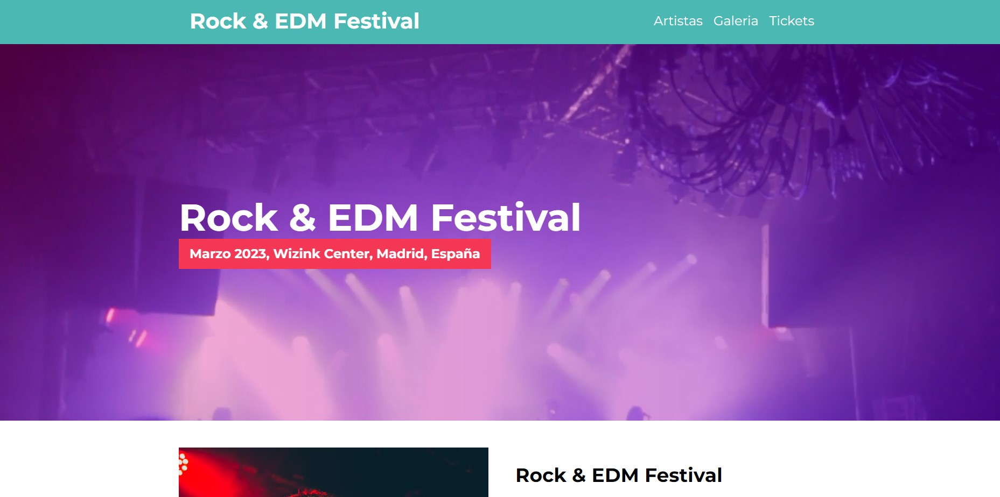

# 
# Festival Música

Diseño básico y minimalista sobre una web de un festival de musica.
Es una SPA (Single Page Application)

## Demo



[https://jgarciaprojects-festivalmusica.netlify.app](https://jgarciaprojects-festivalmusica.netlify.app)
## Tecnologias Usadas

**Client:** HTML, CSS, Sass, Gulp

## Instalación

Primero trendrás que clonar el proyecto:

```bash
  git clone https://github.com/jgarciah-esliceu/FrontendStore.git
```
Luego deberas ejecutar los siguientes comandos en la carpeta del proyecto:

- Puedes instalar la extension LiveServer en VSCode para ver el proyecto en vivo.
